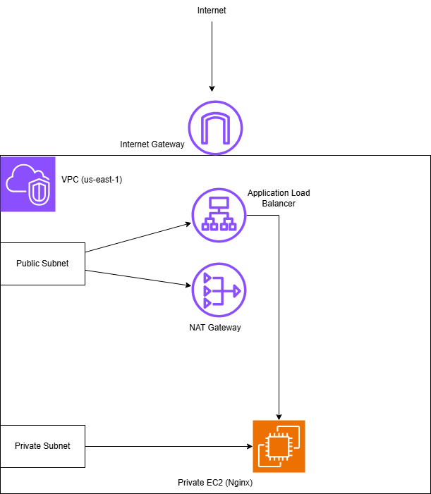
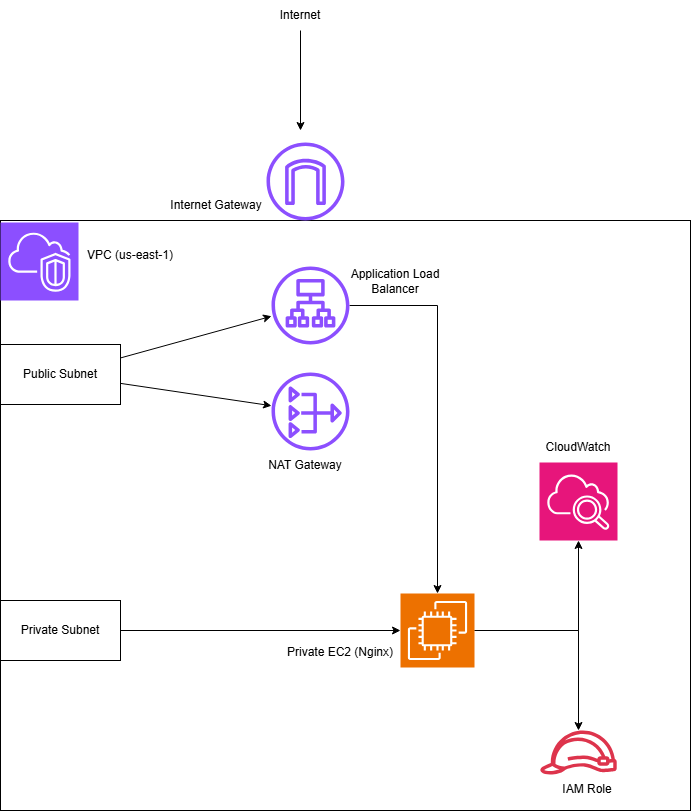
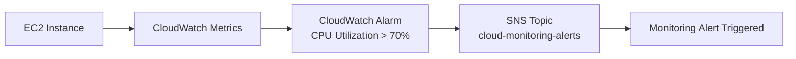

# AWS Cloud Engineering Projects

This repository contains hands-on AWS infrastructure projects built using **Terraform**.

The goal of these projects is to demonstrate real-world **cloud engineering practices**, including Infrastructure as Code, secure AWS networking architecture, monitoring, and production-style Terraform project structure.

---

## AWS Cloud Engineering Portfolio

Production-style AWS infrastructure projects demonstrating Terraform, VPC networking,
CI/CD pipelines, monitoring, and scalable application architectures.

Projects included in this repository:

1. Secure Web Baseline
   - EC2 + security groups + IAM hardening

2. Terraform Remote Backend
   - S3 + DynamoDB state locking

3. Production Web Platform
   - VPC + ALB + EC2 architecture

4. Cloud Operations Platform
   - Infrastructure automation and operations tooling

5. Cloud Monitoring
   - CloudWatch alarms and metrics monitoring

6. CI/CD Platform
   - Docker + GitHub Actions + ECR + EKS

7. 3-Tier Application Architecture
   - ALB + Auto Scaling + RDS deployed with Terraform

---

## Projects

### 1. Secure Web Baseline

**Directory:** `project-01-secure-web-baseline`

Architecture:



**Key components**

* Custom VPC
* Public Application Load Balancer
* Private EC2 instance running Nginx
* NAT Gateway for outbound access
* Secure public/private subnet architecture
* Hardened security groups

This project demonstrates **secure AWS network design and load-balanced web infrastructure**.

---

### 2. Terraform Remote Backend

**Directory:** `project-02-terraform-backend`

**Key components**

* S3 bucket for Terraform state storage
* DynamoDB table for Terraform state locking
* Server-side encryption enabled
* Versioning enabled
* Public access blocked

This project demonstrates **production-grade Terraform state management best practices**.

---

### 3. Production Web Platform

**Directory:** `project-03-prod-web-platform`

Architecture:



**Key components**

* Multi-file Terraform architecture
* Custom VPC with public and private subnets
* Internet Gateway + NAT Gateway
* Application Load Balancer
* Private EC2 instance running Nginx
* IAM role attached to EC2
* CloudWatch monitoring and alarms
* Secure security group configuration

This project simulates a **real-world cloud infrastructure deployment with monitoring and observability**.

---

## Skills Demonstrated

* Terraform Infrastructure as Code
* AWS VPC architecture design
* Public vs Private subnet segmentation
* Application Load Balancer configuration
* NAT Gateway implementation
* IAM role-based access control
* CloudWatch monitoring and alarms
* Secure Terraform remote backend setup
* Production-style AWS infrastructure design

---

### 4. Cloud Ops Platform (CI/CD → ECR → EKS)

**Directory:** `project4-cloud-ops-platform`

**What it is:** A production-style CI/CD pipeline that builds a Docker image, pushes it to Amazon ECR, and deploys it to Amazon EKS using GitHub Actions (rolling updates).

Pipeline flow:

GitHub → GitHub Actions → Docker → Amazon ECR → Amazon EKS → AWS Load Balancer

**Key components**
* Dockerized NGINX web app (`app/`)
* GitHub Actions workflow (`.github/workflows/deploy-eks.yml`)
* Amazon ECR repository (image registry)
* Amazon EKS deployment + service (`kubernetes/`)
* AWS Load Balancer public endpoint

This project demonstrates **real-world DevOps workflow automation**: build → push → deploy with Kubernetes rolling updates.

### 5. Cloud Monitoring Infrastructure (Terraform)

**Directory:** `project-5-cloud-monitoring`

Architecture:



**Key components**

* Terraform Infrastructure as Code deployment
* Amazon EC2 instance running Amazon Linux 2023
* CloudWatch metric monitoring for CPU utilization
* CloudWatch alarm triggering at **70% CPU usage**
* Amazon SNS topic for alert notifications
* Modular Terraform structure using a monitoring module

This project demonstrates **automated infrastructure monitoring and alerting using Terraform and AWS observability services**.

## Skills Demonstrated

* AWS CloudWatch monitoring and alert automation
* AWS SNS notification infrastructure

### 6. Terraform Infrastructure CI/CD

Directory: `project-06-terraform-cicd`

This project demonstrates automated Terraform infrastructure deployment using GitHub Actions CI/CD pipelines.

Pipeline flow:

Developer → GitHub → GitHub Actions → Terraform → AWS Infrastructure

Key components

• GitHub Actions CI/CD pipeline  
• Terraform Infrastructure as Code  
• Automated Terraform plan and apply workflow  
• AWS infrastructure deployment automation

### 7. Terraform VPC 3-Tier Application Architecture

**Directory:** `project-07-vpc-app-architecture`

This project demonstrates a production-style AWS **three-tier application architecture** fully defined using **Terraform Infrastructure as Code**.

The infrastructure provisions a custom VPC, networking layers, load balancing, auto scaling compute, and a managed database tier.

---

### Architecture Overview

```
Internet
   │
   ▼
Application Load Balancer
   │
   ▼
Auto Scaling Group (EC2 instances)
   │
   ▼
Amazon RDS MySQL
```

The environment is deployed inside a custom **VPC with multi-AZ subnet segmentation** to separate public access, application compute, and database resources.

---

### Core Infrastructure Components

* **Custom VPC**
* **2 Public Subnets**
* **2 Private Application Subnets**
* **2 Private Database Subnets**
* **Internet Gateway**
* **Route Tables**
* **Security Groups**
* **Application Load Balancer (ALB)**
* **Target Group & Listener**
* **EC2 Launch Template**
* **Auto Scaling Group**
* **Amazon RDS MySQL**

---

### Security Design

Network access is tightly controlled through security groups:

| Layer         | Access                                       |
| ------------- | -------------------------------------------- |
| ALB           | Accepts HTTP traffic from the internet       |
| EC2 Instances | Accept HTTP only from the ALB security group |
| RDS Database  | Accept MySQL traffic only from EC2 instances |

The **database tier is deployed in private subnets**, preventing direct internet access.

---

### Terraform Concepts Demonstrated

* Infrastructure as Code
* Modular cloud architecture
* AWS VPC networking
* Load balancing
* Auto scaling compute infrastructure
* Managed database provisioning
* Secure security group design
* Environment outputs and variable configuration

---

### Technologies Used

* Terraform
* AWS VPC
* AWS Subnets
* AWS Route Tables
* AWS Security Groups
* AWS Application Load Balancer
* AWS EC2
* AWS Auto Scaling
* AWS RDS (MySQL)

---

### Status

Terraform infrastructure architecture complete.
Application bootstrap and health-check debugging were explored as part of infrastructure troubleshooting during development.

---

## Author

**Xavier Simpson**
AWS Certified Solutions Architect – Associate

GitHub: https://github.com/XSimpson765
