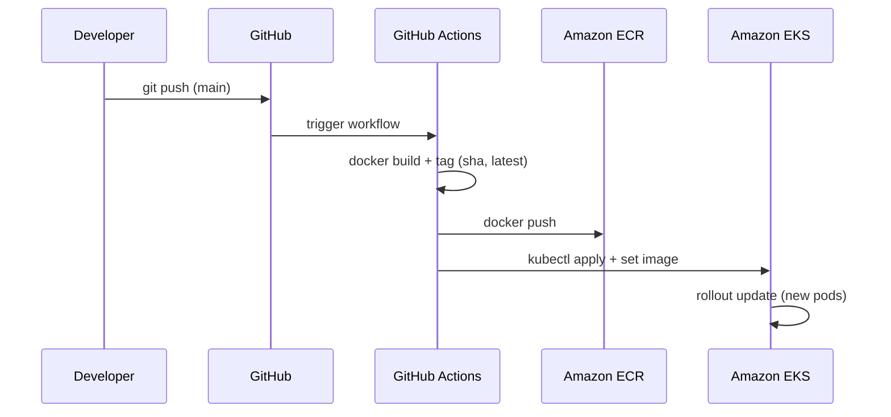

# Project 4 – Cloud Ops Platform (CI/CD → ECR → EKS)

This project demonstrates a **complete cloud-native CI/CD pipeline** that automatically builds, pushes, and deploys a containerized application to **Amazon EKS** using **GitHub Actions**.

The deployment is exposed publicly through an **AWS Application Load Balancer**.

---

# Architecture



---

# Technologies Used

* AWS EKS (Kubernetes)
* AWS ECR (Container Registry)
* Docker
* GitHub Actions
* Kubernetes Deployments
* Kubernetes Services
* AWS Load Balancer Controller
* NGINX Container

---

# Repository Structure

```
project4-cloud-ops-platform
│
├── app
│   ├── Dockerfile
│   └── index.html
│
├── kubernetes
│   ├── deployment.yaml
│   └── service.yaml
│
├── terraform
│   └── (optional infrastructure provisioning)
│
└── README.md
```

---

# Application Container

A simple **NGINX container** serves a static web page.

### Dockerfile

```dockerfile
FROM nginx:alpine
COPY index.html /usr/share/nginx/html/index.html
```

---

# CI/CD Pipeline

The pipeline is defined in:

```
.github/workflows/deploy-eks.yml
```

When code is pushed to the **main branch**, GitHub Actions automatically:

1. Builds a Docker image
2. Tags the image with the Git commit SHA
3. Pushes the image to Amazon ECR
4. Updates the Kubernetes deployment
5. Performs a rolling update in EKS

---

# Deployment Flow

```
git push
   │
   ▼
GitHub Actions
   │
   ├── Docker build
   ├── Docker push → Amazon ECR
   │
   ▼
kubectl set image deployment/web nginx=<ECR_IMAGE>
   │
   ▼
Rolling update on Amazon EKS
   │
   ▼
Application available through AWS Load Balancer
```

---

# Kubernetes Deployment

The application runs in a Kubernetes **Deployment**.

Example:

```
kubectl get pods
kubectl get services
kubectl get deployments
```

The service is exposed via a **LoadBalancer**, which automatically provisions an AWS ELB.

---

# Example Output

Public endpoint:

```
http://<load-balancer-dns>
```

Example application page:

```
Deployed from GitHub Actions → ECR → EKS
Repo: AWS-Projects / Project 4
```

---

# CI/CD Security

Sensitive values are stored using **GitHub Actions Secrets**:

* AWS_ACCESS_KEY_ID
* AWS_SECRET_ACCESS_KEY
* AWS_REGION
* ECR_URI
* EKS_CLUSTER_NAME

These secrets are injected into the pipeline during execution.

---

# Skills Demonstrated

This project demonstrates practical experience with:

* Containerization using Docker
* Continuous Integration / Continuous Deployment
* Kubernetes deployment management
* AWS container services (ECR + EKS)
* Infrastructure automation
* GitHub Actions workflows
* Rolling deployments in Kubernetes
* Cloud-native application delivery

---

# What I Learned

* Building automated CI/CD pipelines for Kubernetes
* Managing container images with Amazon ECR
* Deploying applications to Amazon EKS
* Implementing rolling updates with Kubernetes
* Integrating GitHub Actions with AWS services
* Troubleshooting container deployments and image pull issues

---

# Future Improvements

* Helm chart packaging
* Blue/Green deployments
* Canary deployments
* Prometheus + Grafana monitoring
* Terraform-based infrastructure provisioning
* Auto-scaling with Kubernetes HPA

---

# Author

**Xavier Simpson**

Cloud / DevOps Engineer Path  
AWS Certified Solutions Architect – Associate