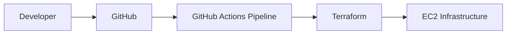

# Project 6 – Terraform Infrastructure CI/CD

This project demonstrates automated Terraform infrastructure deployment workflows using GitHub Actions.

## Architecture

## Technologies

- Terraform
- AWS EC2
- GitHub Actions
- Infrastructure as Code (IaC)

## Pipeline Flow

Developer → GitHub → GitHub Actions → Terraform → AWS Infrastructure

## Skills Demonstrated

- Terraform Infrastructure as Code
- CI/CD pipeline automation
- GitHub Actions workflows
- Automated infrastructure validation